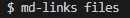
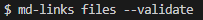
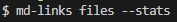
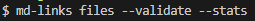

# 📎Proyecto: MD-Links


## 📍1. Introducción

**MD-Links** es una librería para JavaScript que le permite al usuario validar las URLs contenidas en los archivos Markdown (.md). Esta librería te permite obtener la ruta (ubicación) de los archivos Markdown, las URLs y sus descripciones; además, determinar el número de enlaces totales, únicos y rotos.

## 📍2. Instrucciones de uso

Las rutas ingresadas en la terminal pueden ser relativas o absolutas y las opciones que puede usar son: `--stats`, `--validate`. Recuerda que también puedes usar ambas al mismo tiempo: `--stats --validate`.

### Instalación
Puedes hacer la instalación por npm:

```sh
npm i md-links-brith
```
Una siguiente forma de poder ejecutar la librería es a través de la terminal, ingresnado `md-links` seguido de la ruta que se quiere analizar, posteriormente a ello, puedes ingresar las opciones --validate o --stats.

### Casos de uso

#### Primer caso:

```sh
md-links <ruta de archivo>
```
*Ejemplo:*


La información retornada es:
* `href`: URL encontrada.
* `text`: Texto que acompaña a la URL. (`<a>`).
* `file`: Ruta absoluta de la ubicación de la URL encontrada.

#### Segundo caso:

```sh
md-links <ruta de archivo> --validate
```
*Ejemplo:*


La información retornada es:
* `href`: URL encontrada.
* `text`: Texto que acompaña a la URL. (`<a>`).
* `file`: Ruta absoluta de la ubicación de la URL encontrada.
* `status`: Código de respuesta HTTP.
* `message`: Mensaje del estado de las URL, `fail` en caso de fallo u `ok` en caso de éxito.

#### Tercer caso:

```sh
md-links <ruta de archivo> --stats
```
*Ejemplo:*


La información retornada es:
* `Total Links`: Número total de URL encontradas.
* `Unique Links`: Número de URL encontradas pero con repetición.

#### Cuarto caso:

```sh
md-links <ruta de archivo> --stats
```
*Ejemplo:*


La información retornada es:
* `Total Links`: Número total de URL encontradas.
* `Unique Links`: Número de URL encontradas pero con repetición.
* `Broken Links`: Número de URL encontradas con estado `fail`.

## 📍3. Desarrollo
1. Inicialmente se necesita establecer un diagrama de flujo que permita conocer los procesos que el desarrollador seguirá, se utilizó la herramienta `draw.io` para diseñar el diagrama de flujo necesario.

2. [Node.js](https://nodejs.org/en/) - Usado para crear la librería.
3. [npm](https://www.npmjs.com/) - Usado para desplegar el módulo.
4. [jest](https://jestjs.io/docs/api) - Usado para ejecutar el testing de las funcionalidades.
5. [chalk](https://www.npmjs.com/package/chalk/v/4.1.0) - Usado para darle estilos en la información mostrada en la terminal.

## 📍3. Autora
[Briggtte Barboza Nieto](https://github.com/BrithBarboza)